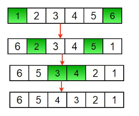

# Reverse an array

1.Reverse the array

## **Write a program to reverse an array or string**

Given an array \(or string\), the task is to reverse the array/string. 



Input  : arr\[\] = {1, 2, 3}

Output : arr\[\] = {3, 2, 1}

Input :  arr\[\] = {4, 5, 1, 2}

Output : arr\[\] = {2, 1, 5, 4}



**Iterative way :**  
  

1. Initialize start and end indexes as start = 0, end = n-1 
2. In a loop, swap arr\[start\] with arr\[end\] and change start and end as follows :   start = start +1, end = end – 1



```python
# Iterative python program to reverse an array
# Function to reverse A[] from start to end
def reverseList(A, start, end):
    while start < end:
        A[start], A[end] = A[end], A[start]
        start += 1
        end -= 1

# Driver function to test above function
A = [1, 2, 3, 4, 5, 6]
print(A)
reverseList(A, 0, 5)
print("Reversed list is")
print(A)
```

**Output :** 

```python
1 2 3 4 5 6 
Reversed array is 
6 5 4 3 2 1 
```

**Time Complexity :** O\(n\)

**Recursive Way :**  
  

1. Initialize start and end indexes as start = 0, end = n-1 
2. Swap arr\[start\] with arr\[end\] 
3. Recursively call reverse for rest of the array.

```python
# Recursive python program to reverse an array
 
# Function to reverse A[] from start to end
def reverseList(A, start, end):
    if start >= end:
        return
    A[start], A[end] = A[end], A[start]
    reverseList(A, start+1, end-1)
 
# Driver function to test above function
A = [1, 2, 3, 4, 5, 6]
print(A)
reverseList(A, 0, 5)
print("Reversed list is")
print(A)

```

**Output :** 

```python
1 2 3 4 5 6
Reversed array is
6 5 4 3 2 1
```

**Time Complexity :** O\(n\)

**Another Approach:** Using Python List slicing

```python
def reverseList(A):
  print( A[::-1])
     
# Driver function to test above function 
A = [1, 2, 3, 4, 5, 6] 
print(A) 
print("Reversed list is") 
reverseList(A)  

```

**Output:**

```python
[1, 2, 3, 4, 5, 6]
Reversed list is
[6, 5, 4, 3, 2, 1]
```

